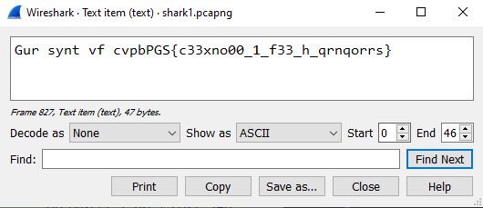
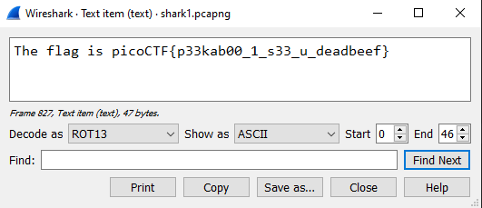

# Wireshark doo dooo do dooo...
Author: dch0017

## Challenge Description
Can you find the flag?

## Getting Started
First let's download the file and it is a pcapng file. These are used to store information from a WireShark packet capture. Let's go ahead and open up the file in WireShark.</br>

</br>

We are greeted by a lot of entries. We can do a quick search to see if we can save ourselves some time.

## Searches and Regex
I add a custom search, change the search location to ```packet bytes``` and my search term to [Regular Expression](https://ubuntu.com/blog/regex-basics). I try to do a base search for ```picoCTF{.*}``` but no results come back.</br>

</br>

I'll try using regex to match the pattern of the flag, which is:
```7 alphabet characters, open curly brace, any number of characters, closed curly brace```</br></br>

This equates to the simple regex of: ```[A-Za-z]{7}{.*}```</br>

And we get a hit!</br>

</br>

## Decoding 

So now we found something that definitely looks like a flag, but it is not readable. (yet)

```Gur synt vf cvpbPGS{c33xno00_1_f33_h_qrnqorrs} ```

The nice thing about Wireshark is you can show the packet bytes ```Ctrl + SHIFT + O``` and it brings up a page to decode the string.</br>

</br>

We set the ```Decode as``` option to ```ROT13``` and we have our flag:</br>


## Flag
```picoCTF{p33kab00_1_s33_u_deadbeef} ```